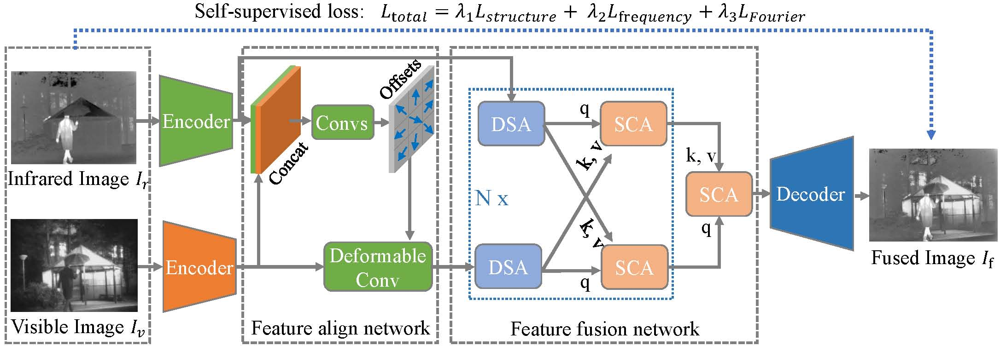

# STFNet: Self-supervised Transformer for Infrared and Visible Image Fusion (TETCI 2024)
**Abstract**
Most of the existing infrared and visible image fusion algorithms rely on hand-designed or simple convolution-based fusion strategies. However, these methods cannot explicitly model the contextual relationships between infrared and visible images, thereby limiting their robustness. To this end, we propose a novel Transformer-based feature fusion network for robust image fusion that can explicitly model the contextual relationship between the two modalities. Specifically, our fusion network consists of a detail self-attention module to capture the detail information of each modality and a saliency cross-attention module to model contextual relationships between the two modalities. Since these two attention modules can obtain the pixel-level global dependencies, the fusion network has a powerful detail representation ability which is critical to the pixel-level image generation task. Moreover, we propose a deformable convolution-based feature align network to address the slight misaligned problem of the source image pairs, which is beneficial for reducing artifacts. Since there is no groundtruth for the infrared and visible image fusion task, it is essential to train the proposed method in a self-supervised manner. Therefore, we design a self-supervised multi-task loss which contains a structure similarity loss, a frequency consistency loss, and a Fourier spectral consistency loss to train the proposed algorithm. Extensive experimental results on four image fusion benchmarks show that our algorithm obtains competitive performance compared to state-of-the-art algorithms.



## Training and Testing
* Require Python 3.7, PyTorch 1.9.0, Ubuntu16.0
* Run `ltr/run_training_STFNet.py` for training end-to-end.
* Run `ltr/run_test_STFNet.py` for testing single or multiple models.

## Download
* Download checkpoints for testing at [Baidu Yunpan](https://pan.baidu.com/s/1E6dHeB-3nws9FBkoU64mrA?pwd=jbnv)

## Citation

```
@article{liu2024stfnet,
  title={STFNet: Self-Supervised Transformer for Infrared and Visible Image Fusion},
  author={Liu, Qiao and Pi, Jiatian and Gao, Peng and Yuan, Di},
  journal={IEEE Transactions on Emerging Topics in Computational Intelligence},
  year={2024},
  publisher={IEEE}
}
```